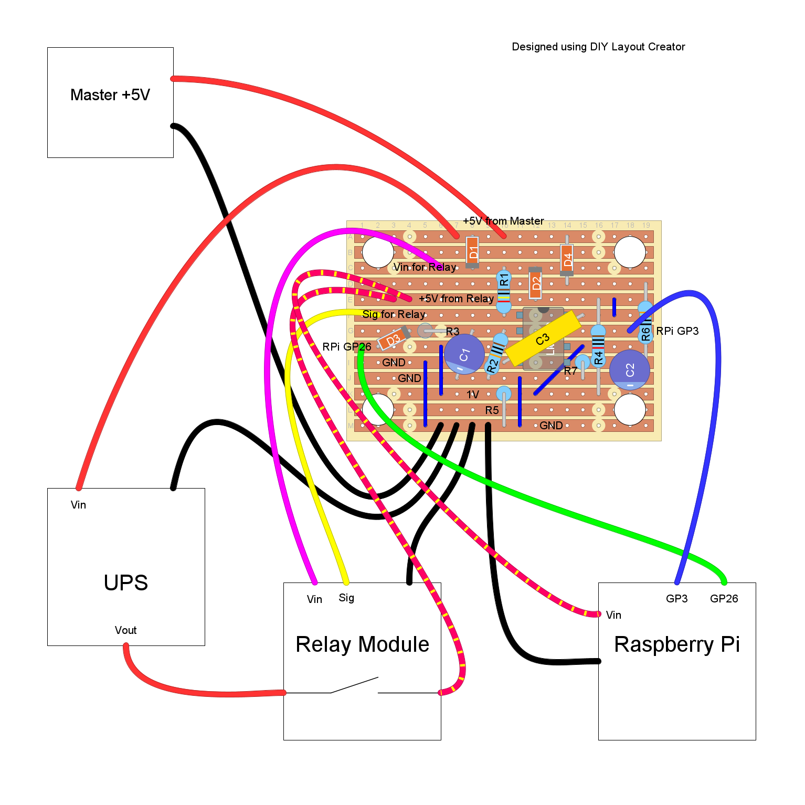

# Master-Slave-Raspberry-Pi
Shutdown and turn off Raspberry Pi on master power off
(Under development...)

The project enables the Raspberry Pi to be a slave of another device.
If another device is turned on the Pi shall also turn on.
If another device turns off the Pi shall shutdown and turn off.

