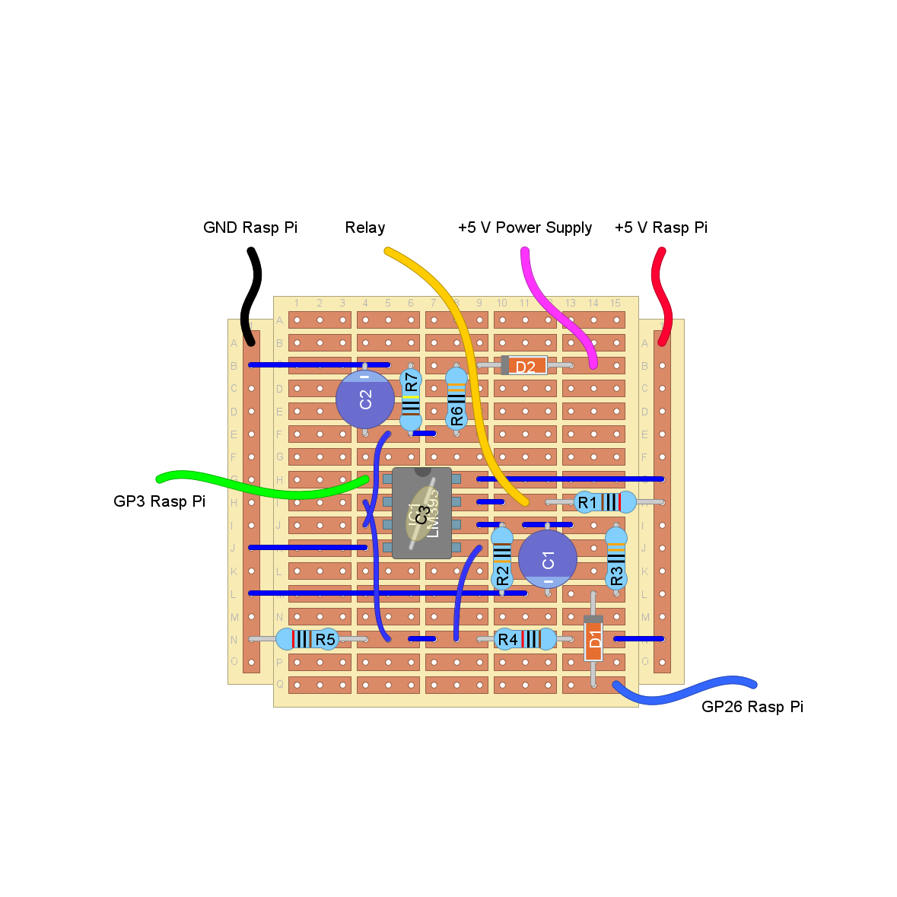

# Master-Slave-Raspberry-Pi
The project enables the Raspberry Pi to be a slave of another device.
If another device is turned on the Pi also turns on.
If another device turns off the Pi shutdowns and turns off.

# Circuit and board




# Implementation description
The functionality is build upon the Pi configuration possibility to initiate the shutdown from the low signal on the GPIO 03 and signal the finished shutdown with hight signal on the GPIO 26.

For this the following parameters needs to be added to the `/boot/config.txt`
```
# enable shutdown on gpio 3 down
dtoverlay=gpio-shutdown

# enables high on gpio 26 after the system shutdown
dtoverlay=gpio-poweroff
```

## Circuit elements purpose

**UPS Module** continues to provide power if the main power supply is turned off

**Relays module 1** prevents the batteries drain if the device is switched of for the log time

**Relays module 2** switches on/off the Raspberry Pi power supply

**R1** switches both relays to on after the main power supply is turned on
 
**IC1** inverts the high signal from GPIO 26 to low signal and turns off the both relays. It also implements the flip for the delay circuit R2, C1

**IC2** does not invert the signal but is necessary for the delay circuit to implement fast flip after the R7 drains the voltage on the C2 below the reference voltage of 1 V

**R2, C1** implement delay of 2 sec before the Raspberry Pi is powered again

**R7, C2** implement delay of 20 sec between the main power los and the shutdown signal to the Raspberry Pi

**R3, R6** are for current limiting

**D1, D2** prevent the backflow

**R4, R5** provide reference 1 V to the IC2, IC1 

**C3** is connected directly between "+" and "-" of the IC power supply as suggested by the reference implementation.


