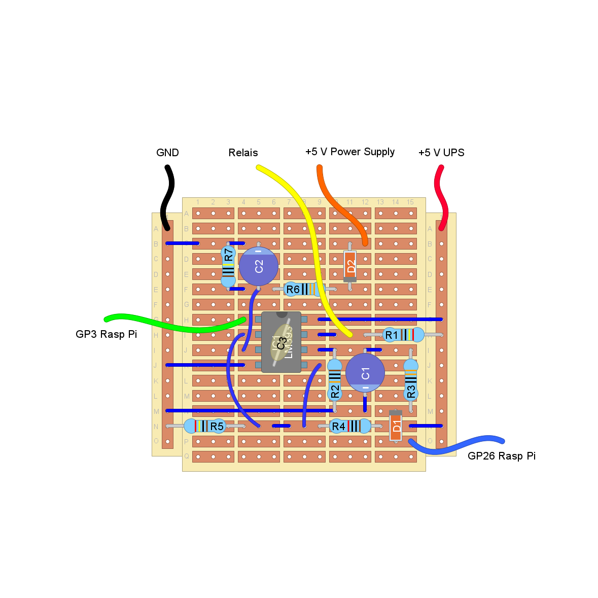

# Master-Slave-Raspberry-Pi
The project enables the Raspberry Pi to be a slave of another device.
If another device is turned on the Pi also turns on.
If another device turns off the Pi shutdowns and turns off.

# Description

